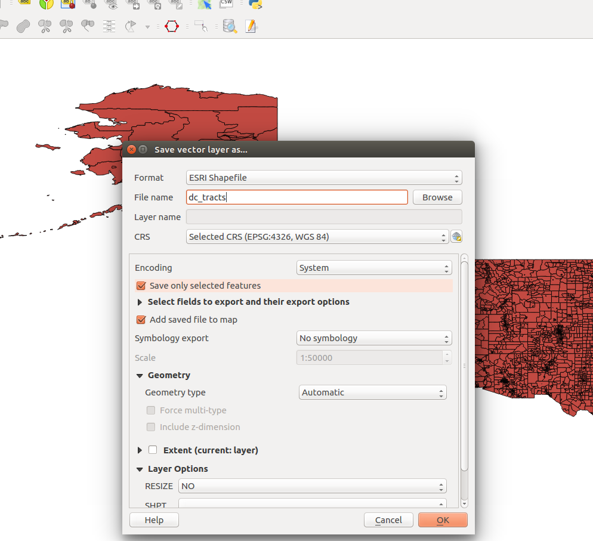
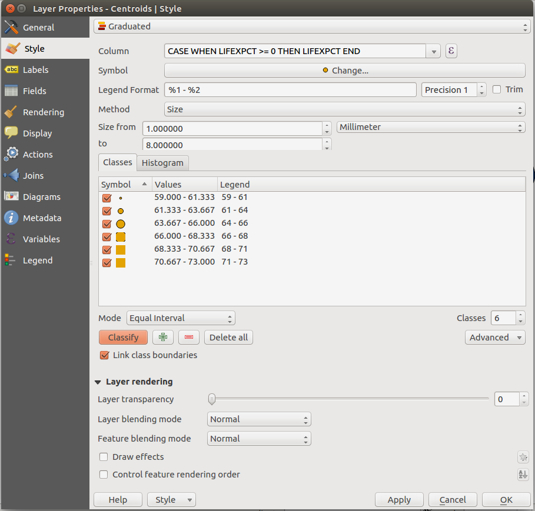

QMSS GIS/Spatial Analysis
=========================

While everyone is still getting settled and added to canvas, we'll share the files and notes here.

Contents
--------

- [Downloads/Software](#downloads)
- [Syllabus](syllabus.pdf)
- [Lab 2 - September 18](#lab2)
- [Lab 1 - September 11](#lab1)
- [Homework 1](#homework1)


Downloads
---------
Software: QGIS 2.18 (use QGIS Desktop)

- [Syllabus](syllabus.pdf)
- HW 1 file: [MD_PAdata](MD_PAdata.zip)
- Lab 1 file: [Life Expectancy](lifeexpectancy.zip)


Lab2
----
### Sources of Data

- [IPMUMS International](https://international.ipums.org/international/)
- [Global Administrative Areas](http://gadm.org/country)
- [Columbia Spatial Data](https://geodata.library.columbia.edu/)
- [US Census Shapefiles](https://www.census.gov/geo/maps-data/data/tiger-line.html)
- [US Census---MSA](https://www.census.gov/programs-surveys/metro-micro/data/datasets.html)
- CDC, NIH

### Step 1: Import the Census Tracts
As in the previous lab, in add the census tract data: ```Layer > Add Layer > Add Vector Layer```. The source should be the file ```CensusTracts_2.shp```.


### Step 2: Select only Washington D.C.

Let's zoom in only into Washington D.C. Although you could select this with the Polygon shape tool, for example, we'll by "Select features using an expression".


We'll select by the feature ```STATE_FIPS```, for which the value ```11``` refers to Washington D.C. In the expression editor, we select by ```"STATE_FIPS" = '11'```, like so:


Once it's selected, you can save the selection to a new layer. In the menu bar, go to ```Layer > Save as...```



Don't forget to check the ```Save only selected features``` box. You can now remove the CensusTracts_2 layer, and ```Zoom to Layer``` for your newly selected layer.


### Step 3: Import the zombies2.csv

Now, we'll import the Zombie data. In the menu bar, go to ```Layer > Add Layer > Add Delimited Text Layer```. Because the zombies2 file is a .csv file, make sure the ```CSV (comma separated value)``` radio button is marked. 

When it asks for the ```Coordinate Reference System``` (CRS), select ```USA_Contiguous_Equidistant_Conic```. You can also change this later (in class, we actually selected ```WGS 84``` first, then later updated it).


### Step 4: Reprojection

*If you don't see the zombie data yet, don't worry*. Right now, your two layers (DC and Zombies) may be in different coordinate reference systems, and QGIS can't display two CRS's on top of each other.

There are two different ways to deal with this. You can right-click on the DC layer, click on ```Set Layer CRS```, and change it to ```USA_Contiguous_Equidistant_Conic```, to match the Zombie layer.


Then, zoom in onto the Zombie layer to recenter the map.

You can also see that 'on the fly' CRS transformation (OTF) is enabled, under the menu bar, ```Project > Project Properties... > CRS```. However, for this lab, uncheck that box to unenable OTF transformation. (This automatically reprojects a layer into the same coordinate system, so that they can be displayed at the same time).

You can read more in the QGIS documentation [here](https://docs.qgis.org/2.6/en/docs/training_manual/vector_analysis/reproject_transform.html).


### Step 5: Focusing on DC Zombies

We want to select all the zombie incidents that occured in DC, and forget the rest of the data. To do this, we'll use a tool called Spatial Query.

At this point, you may need to install a Plugin. Go to the menu bar, select ```Plugins > Manage and Install Plugins``` and search for ```Spatial Query```.


Now, in the menu bar, you should be able to find ```Vector > Spatial Query > Spatial Query```. This will open up a dialog box. Set ```Select source features from``` to your Zombies layer (because we want to select zombie incidents).


Save the selection to a new layer, as before. Don't forget to save only selected features, and also if you don't see the points show up, check the CRS setting.

### Step 6: Making buffers

Here, we'll learn how to create buffers around points. In the menu bar, go to ```Vector > Geoprocessing Tools > Fixed distance buffers```. The units should be in meters, so below, we're setting each buffer size to be 100 meters.


Another way is to download the MMQGIS plugin, and then create buffers from the menu bar, ```MMQGIS > Create > Create Buffers```.


So you get something like


### Step 7: Joining Data
We can combine the Zombie data and the DC data into one layer (thus, joining them). In the menu bar, go to ```Vector > Data Management Tools > Join Attributes by Location```.

Set ```Target vector layer``` to the DC layer, and ```Join vector layer``` to the zombies layer. Under Geometric predicate, select ```intersect```. Finally, under Joined table, select ```Keep all records (including all non-matching target records)```.


As a result, when we go inspect the Attributes Table (right click on the newly formed layer), we see that the Zombies data is contained at the end, along with the DC data all in one table.


Lab1
----
Types of files used by QGIS:

- .dbf is a database file, with data in tabular form.
- .shx is a required file.
- .shp is a shape file, which is imported into GIS software. This is the one you interact with.
- .prj is a projection file (not within this lab); this contains data on how we project data onto a plane. For example, flattening a sphere onto a plane.

## Step 1: Importing data

- In the menu bar, go to ```Layer > Add Layer > Add Vector Layer``` to import your .shp file. In this case, since there is no projection data, we'll go with the default, WGS 84.

## Step 2: Selecting Regions

- Draw a box using the select button.


- Try selecting only South America.

## Step 3: Exporting Selected Region to New Layer

- Go to ```Layer > Save As```
- Be sure to check the ```Save only selected features``` box.
- Now, save South America to a new .shp file.

## Step 4: Removing the rest of the world

- You can right click ```newsweek_data``` on the ```Layers Panel```, and click ```remove```.

## Step 5: Inspecting data

- Right click on South America in the ```Layers Panel```.
- Click on ```Attribute Table``` to see the associated data.
- A useful too is the Expression Builder to filter out the specific data you want to look for. At the top of the Attribute Table menu bar, there is a yellow square with an $\epsilon$.


## Step 6: Changing Style of Objects

- Right click on South America in the ```Layers Panel``` again, and click on ```Properties```, and go to the ```Style``` tab.
- You can change the color, fill, outline in here.
- Let's try to categorize by different countries. At the top of the menu, click on the drop-down menu saying "Single Symbol", and change to "Categorized".
- We can now create a visualization that are based on the data. In ```Column``` you can choose a data field. Select one, then near the bottom, click on ```Classify```.


- Now, let's use ```Graduated``` instead of ```Categorized```.
- For example, change ```Column``` to ```POP_K```, and click on ```Classify```, like so:


- Note that you can change the mode. ```Quantile (Equal Count)``` makes a lot of sense, for example, for population:


## Step 7: Creating Points

- Up to now, we've been working with *polygons*. But we can also create points.
- Let's create the *centroid* of a polygon (essentially, the center of mass of the shape).
- Go to the menu bar, ```Vector > Geometry Tools > Polygon centroids```, then just hit ```Run```.


- Now, right-click on ```Centroids``` in the Layers Panel, and go to ```Properties```.
- Set the classification method to ```Graduated```.
- Under ```Method```, choose ```Size``` instead of ```Color```.
- Let's work with ```POP_K``` in ```Column``` again.
- Hit classify.


- Go ahead and play with the settings.

## Step 8: Add Labels

- Instead of the ```Style``` tab, click on ```Labels```.
- On top, change the drop-down menu with ```Show labels for this layer```.
- Set ```Label with``` to ```NAME```, for example.


- The white buffers around the text was set under ```Buffers```.

## Step 9: Saving

- Go to the menu bar, and go to ```Project > New Print Composer```
- One of the buttons on the right button bar is ```Add new map```.
- Create a region on the page for the map.


- Add titles by including a text box. Can also add a legend.
- To export, go to the menu bar, ```Composer > Export as Image``` or ```Composer > Export as PDF```.
- Play around with other features!

## Extra

- After class, a classmate mentioned that if you plot ```LIFEXPCT```, there is one value that is negative!


- You can do a quick clean up of the data with the *expression editor* for the ```Column``` field, like so:



- What this says is: "in the case when ```LIFEXPCT``` is nonnegative, then return ```LIFEXPCT``` (end)." Thus, only when the value of life expectancy is nonnegative will the value be shown.


Homework1
---------
### Files

[MD_PAdata](MD_PAdata.zip)

### Intro to QGIS

The goal of this homework exercise is to get you started using QGIS for basic data mapping and visualization tasks.   Using the data set for Maryland and Pennsylvania counties in “MDPAdata.shp” investigate and map two of the variables that you suspect might be related to one another.   Use choropleth shading for both.  Use either quantiles or natural breaks to display the data, but be sure to explain your choice.

Save your maps to an image file and paste them into a word document for your write-up.

Once you have used QGIS to map the two variables, write three-four paragraphs (12 pt font and double-spaced) commenting on what you see in these data once they are visualized.   Your write-up with your newly created maps should be posted to Canvas via the upload functionality for this assignment.  Filenames should be formatted as follows: Lastname_Firstname_HW1.doc  (or docx).


